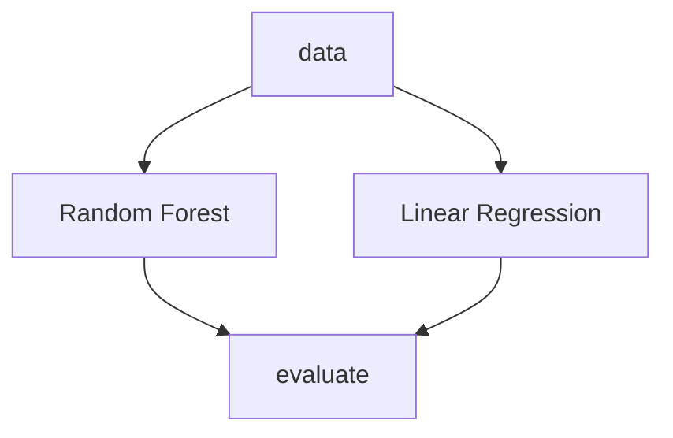

# Example for R&D repository structure

## Installation

```bash
python -m venv .venv
echo "PYTHONPATH=$PWD" >> .venv/bin/activate
source .venv/bin/activate
pip install -r requirements.txt
```

## Run

### 1 - Study `bio-1023`

> Example of workflow using Jupyter Notebooks & DVCLive

Workflow:
- Navigate to the study directory: `cd bio-1023`
- Run code in JN: `jupyter lab`
- Commit & push results with Git and DVC
  
### 2 - Study `gen-2024`

> Common DVC pipeline with multiple stages



Workflow:
- Navigate to the study directory: `cd gen-2024`
- Run the pipeline: `dvc exp run`
- Commit & push results with Git and DVC


## Collaboration workflow

### 1 - Setup DVC remote storage

```bash
dvc add remote gcp gs://my-bucket
```

### 2 - Push artifacts to remote storage

```bash
dvc push 
```

### 3 - Pull artifacts from remote storage

```bash
dvc pull
```

#### 3.1 - Pull specific artifact (alternative ways)

**[dvc pull](https://dvc.org/doc/command-reference/pull)** - when you are inside the repository

> Download tracked files or directories from [remote storage](https://dvc.org/doc/user-guide/data-management/remote-storage) based on the current `dvc.yaml` and `.dvc` files, and make them visible in the workspace.
> 

```bash
git checkout a972308              # Commit created after DVC Remote setup
dvc pull bio-1023/data/features.csv
```

**[dvc get](https://dvc.org/doc/command-reference/get)** - when you are outside the repository

> Download a file or directory tracked by DVC or by Git into the current working directory.

```bash
dvc get https://github.com/mnrozhkov/example-rnd-monorepo \
    bio-1023/data/features.csv \
    -o bio-1023/data/features.csv \
    --rev a972308
```

**[dvc artifacts get](https://dvc.org/doc/command-reference/artifacts/get)** - by registered aritfact name & version

```bash
dvc artifacts get https://github.com/mnrozhkov/example-rnd-monorepo \
    bio-1023:data-bio-1023 \
    -o bio-1023/data/features.csv \
    --rev v2.0.1
```
