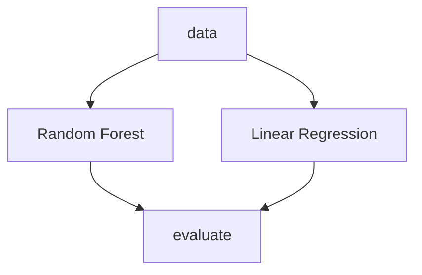

# Example for R&D repository structure

## Installation

```bash
python -m venv .venv
echo "PYTHONPATH=$PWD" >> .venv/bin/activate
source .venv/bin/activate
pip install -r requirements.txt
```

## Run

### 1 - Study `bio-1023`

> Example of workflow using Jupyter Notebooks & DVCLive

Workflow:
- Navigate to the study directory: `cd bio-1023`
- Run code in JN: `jupyter lab`
- Commit & push results with Git and DVC
  
### 2 - Study `gen-2024`

> Common DVC pipeline with multiple stages



Workflow:
- Navigate to the study directory: `cd gen-2024`
- Run the pipeline: `dvc exp run`
- Commit & push results with Git and DVC


## Collaboration workflow

### 1 - Setup DVC remote storage

```bash
dvc add remote gcp gs://my-bucket
```

### 2 - Push artifacts to remote storage

```bash
dvc push 
```

### 3 - Pull artifacts from remote storage

```bash
dvc pull
```

### 4 - Pull specific artifact from remote storage

```bash
# git checkout <branch>/<commit>
dvc pull bio-1023/manifest/manifest.pkl
```

### 5 - Pull specific artifact from remote storage

```bash
# git checkout <branch>/<commit>
dvc artifacts get bio-1023/manifest
```

